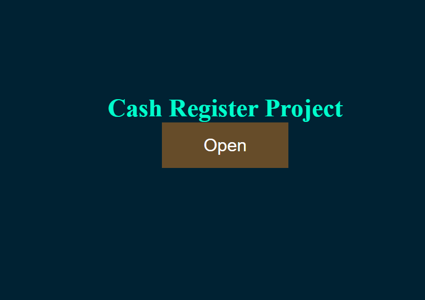
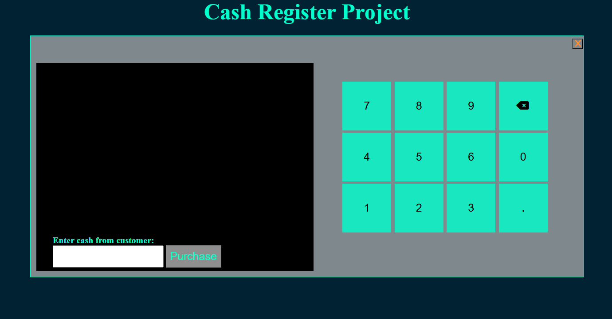
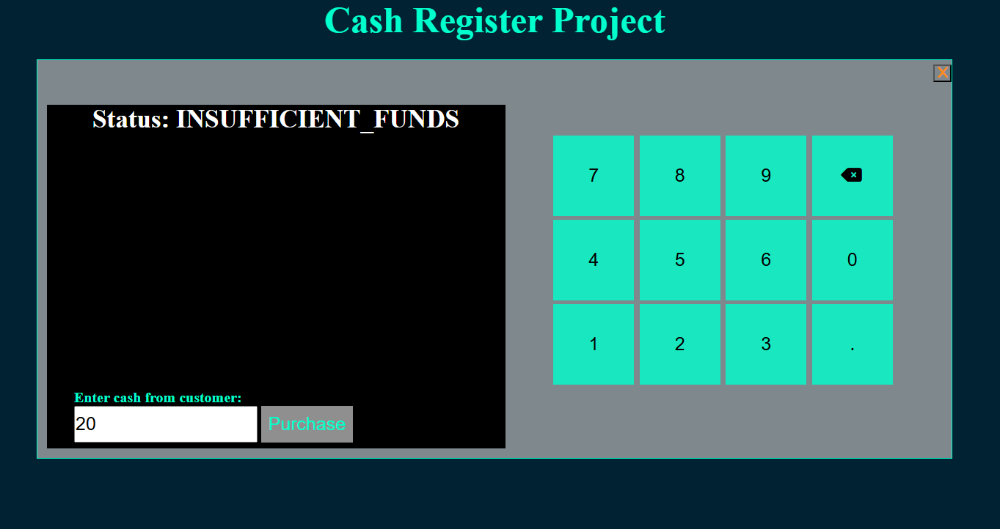
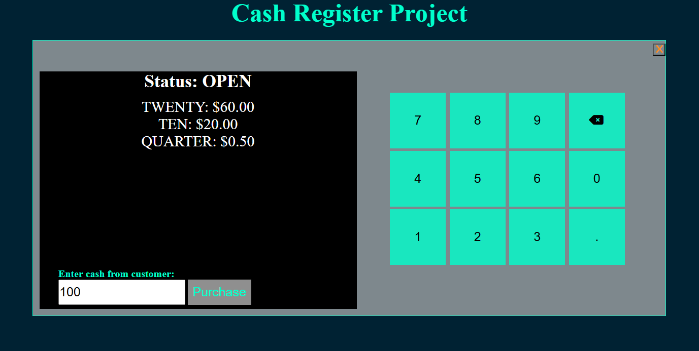

# Cash Register Project

### **Project Description**

Cash Register is a simple program that will calculate and return change to the customer based on the price of the item, the amount of cash provided by the customer, and the amount of cash in the cash drawer.

### **Installation**
You need the latest browser to be able to View.
Follow this link:

https://github.com/Iveto97/freeCodeCamp/tree/main/JavaScript%20Algorithms%20and%20Data%20Structures/cash-register

It is hosted by gitHub.

To access this project on your local files, you can download it using these steps:
1. Open your browser
2. Paste this link 
   
   `https://downgit.github.io/#/home?url=https://github.com/Iveto97/freeCodeCamp/tree/main/JavaScript%20Algorithms%20and%20Data%20Structures/cash-register`

3. This will save .zip file into your download folder
4. Extract files
5. Open the folder
6. Run `index.html` with an active internet

### **Usage**
The application, should show different message:

- `"Status: INSUFFICIENT_FUNDS"`: if `cash-in-drawer` is less than the change due, or if you cannot return the exact change.
- `"Status: CLOSED"`: if `cash-in-drawer` is equal to the change due.
- `"Status: OPEN"`: if `cash-in-drawer` is greater than the change due and you can return change, with the change due in coins and bills sorted in highest to lowest order.
- Alert `"Customer does not have enough money to purchase the item"`: if the value in the `#cash element` is less than `price`.

### **Technologies**
1. HTML
2. CSS
3. JavaScript
4. Git

### **License**

MIT licensed

### **Screenshots**
The Application

