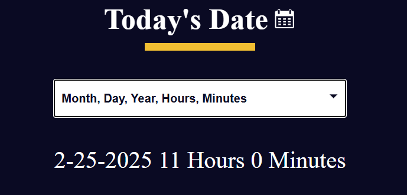

# Date Formatter

### **Project Description**

This project focuses on utilizing the JavaScript Date object to build a simple Date Formatter web application. This application shows the date in different formats, like in one of them are included hours and minutes.

### **Installation**
You need the latest browser to be able to View.
Follow this link:

https://github.com/Iveto97/freeCodeCamp/tree/main/JavaScript%20Algorithms%20and%20Data%20Structures/date-formatter

It is hosted by gitHub.

To access this project on your local files, you can download it using these steps:
1. Open your browser
2. Paste this link 
   
   `https://downgit.github.io/#/home?url=https://github.com/Iveto97/freeCodeCamp/tree/main/JavaScript%20Algorithms%20and%20Data%20Structures/date-formatter`

3. This will save .zip file into your download folder
4. Extract files
5. Open the folder
6. Run `index.html` with an active internet

### **Usage**
The application, displays the current date in the default format (dd-mm-yyyy). Users can choose different date formatting options from the dropdown menu.

The application supports the following date formatting options:

- Day, Month, Year (dd-mm-yyyy): Default format.
- Year, Month, Day (yyyy-mm-dd): Reversed order.
- Month, Day, Year, Hours, Minutes (mm-dd-yyyy-h-mm): Includes hours and minutes.
  
To change the date format, select an option from the dropdown menu, and the displayed date will update accordingly.

### **Technologies**
1. HTML
2. CSS
3. JavaScript
4. Git

### **License**

MIT licensed

### **Screenshots**
The Application

