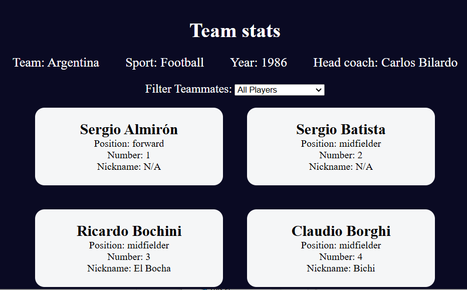
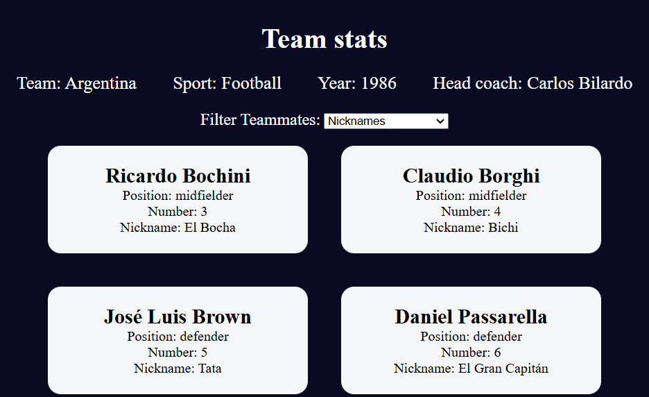
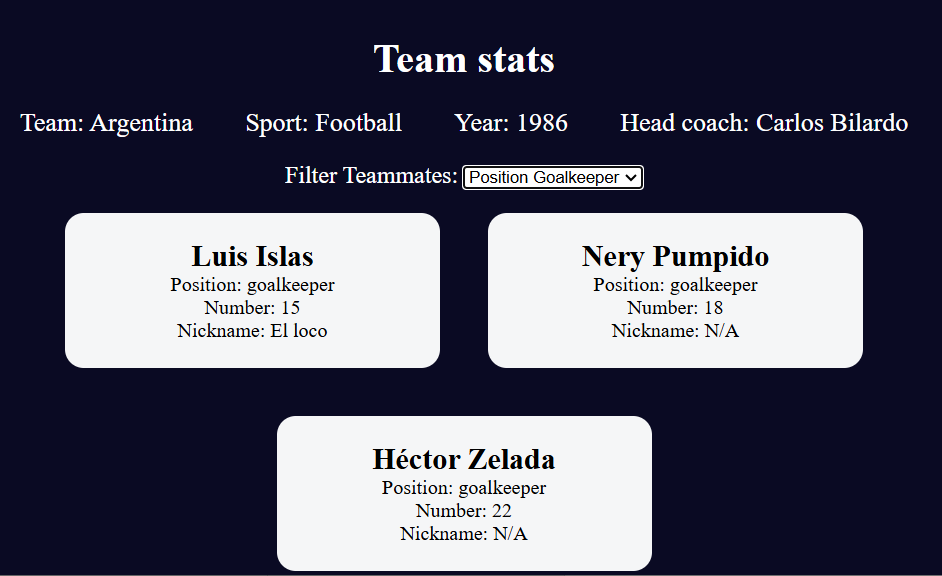

# Football Team Cards

### **Project Description**

In this project, you will build a set of football team cards and learn about nested objects, object destructuring, and default parameters. 
All of the HTML and CSS for this project has been provided. All of the information about the football team will be stored in the data structure. 
The player's cards will be displayed and filtered based on the selection made by the user in the Filter Teammates dropdown menu.

### **Installation**
You need the latest browser to be able to View.
Follow this link:

https://github.com/Iveto97/freeCodeCamp/tree/main/JavaScript%20Algorithms%20and%20Data%20Structures/football-team-cards

It is hosted by gitHub.

To access this project on your local files, you can download it using these steps:
1. Open your browser
2. Paste this link 
   
   `https://downgit.github.io/#/home?url=https://github.com/Iveto97/freeCodeCamp/tree/main/JavaScript%20Algorithms%20and%20Data%20Structures/football-team-cards`

3. This will save .zip file into your download folder
4. Extract files
5. Open the folder
6. Run `index.html` with an active internet

### **Usage**
The application, displays the filtered football team cards. Users can choose nickname or different position options from the dropdown menu.

The application supports the following filter options:

- All players: Default format.
- Nicknames: Filter out player cards that have a nickname.
- Position forward: Filter out player cards that have a forward position.
- Position midfielder: Filter out player cards that have a midfielder position.
- Position defender: Filter out player cards that have a defender position.
- Position goalkeeper: Filter out player cards that have a goalkeeper position.
  
To change the players cards, select an option from the dropdown menu, and the displayed cards will update accordingly.

### **Technologies**
1. HTML
2. CSS
3. JavaScript
4. Git

### **License**

MIT licensed

### **Screenshots**
The Application

