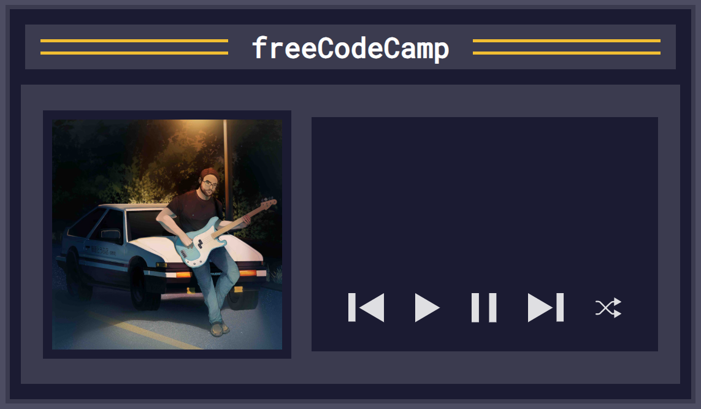
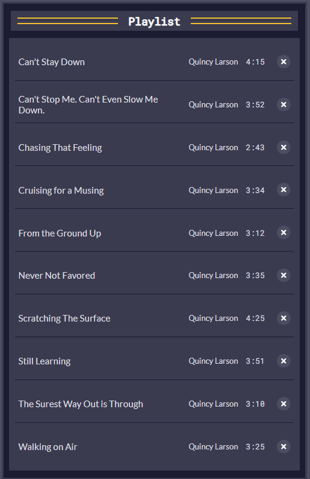

# Music Player

### **Project Description**

It's a Music Player Application that allows user to listen music. It's created with the help of Web Audio API which lets you generate and process audio in web applications.  The music player should keep track of the songs, the current song playing, and the time of the current song. The list of songs displayed on the screen, will be sorted in alphabetical order by title. The user can pause or move to the next or previous song also he can delete all songs and after that can load it again, shuffle the list.

### **Installation**
You need the latest browser to be able to View.
Follow this link:

https://github.com/Iveto97/freeCodeCamp/tree/main/JavaScript%20Algorithms%20and%20Data%20Structures/music-player

It is hosted by gitHub.

To access this project on your local files, you can download it using these steps:
1. Open your browser
2. Paste this link 
   
   `https://downgit.github.io/#/home?url=https://github.com/Iveto97/freeCodeCamp/tree/main/JavaScript%20Algorithms%20and%20Data%20Structures/music-player`
3. This will save .zip file into your download folder
4. Extract files
5. Open the folder
6. Run `index.html` with an active internet

### **Usage**

1. Run the index.html file
2. Click on play button to start the first song. 
3. If you want to move on the next song or previous you can click on next ot previous button. 
4. You can shuffle the songs.

### **Technologies**
1. HTML
2. CSS
3. JavaScript
4. Git

### **License**

MIT licensed

### **Screenshots**
The Application

