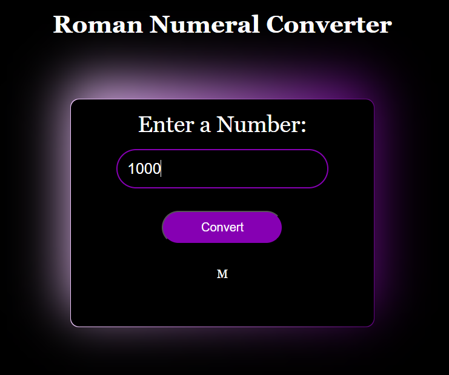

# Roman Numeral Converter

### **Project Description**

Roman numerals are a number system developed in ancient Rome where letters represent numbers. The modern use of Roman numerals involves the letters I, V, X, L, C, D, and M. This web application, takes a given number and turn it into a roman numeral.

### **Installation**
You need the latest browser to be able to View.
Follow this link:

   https://github.com/Iveto97/freeCodeCamp/tree/main/JavaScript%20Algorithms%20and%20Data%20Structures/roman-numeral-converter

It is hosted by gitHub.

To access this project on your local files, you can download it using these steps:
1. Open your browser
2. Paste this link 
   
   https://downgit.github.io/#/home?url=https://github.com/Iveto97/freeCodeCamp/tree/main/JavaScript%20Algorithms%20and%20Data%20Structures/roman-numeral-converter

3. This will save .zip file into your download folder
4. Extract files
5. Open the folder
6. Run `index.html` with an active internet

### **Usage**
   Use this Roman numeral converter to convert numbers from 1 to 3,999 into Roman numerals. Just chose a number and convert it.
  

### **Technologies**
1. HTML
2. CSS
3. JavaScript
4. Git

### **License**

MIT licensed

### **Screenshots**
The Application

