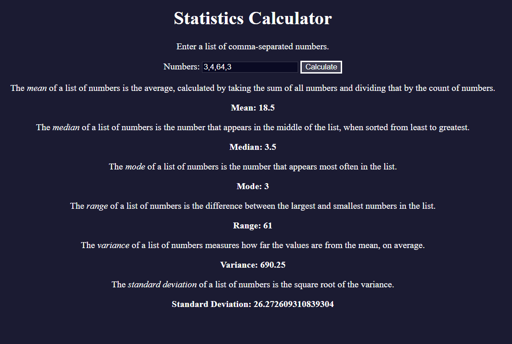

# Statistics Calculator

### **Project Description**

The statistics calculator takes a set of numbers and returns the mean, median, mode, standard deviation, and variance.

### **Installation**
You need the latest browser to be able to View.
Follow this link:

https://github.com/Iveto97/freeCodeCamp/tree/main/JavaScript%20Algorithms%20and%20Data%20Structures/statistics-calculator

It is hosted by gitHub.

To access this project on your local files, you can download it using these steps:
1. Open your browser
2. Paste this link `https://downgit.github.io/#/home?url=https://github.com/Iveto97/freeCodeCamp/tree/main/JavaScript%20Algorithms%20and%20Data%20Structures/statistics-calculator`
3. This will save .zip file into your download folder
4. Extract files
5. Open the folder
6. Run `index.html` with an active internet

### **Usage**
To use this application you should enter a list of comma-separated numbers.

1. Run the index.html file.
2. Enter a list of comma-separated numbers. 
3. Click on "Calculate" button.

### **Technologies**
1. HTML
2. CSS
3. JavaScript
4. Git

### **License**

MIT licensed

### **Screenshots**
The Application

