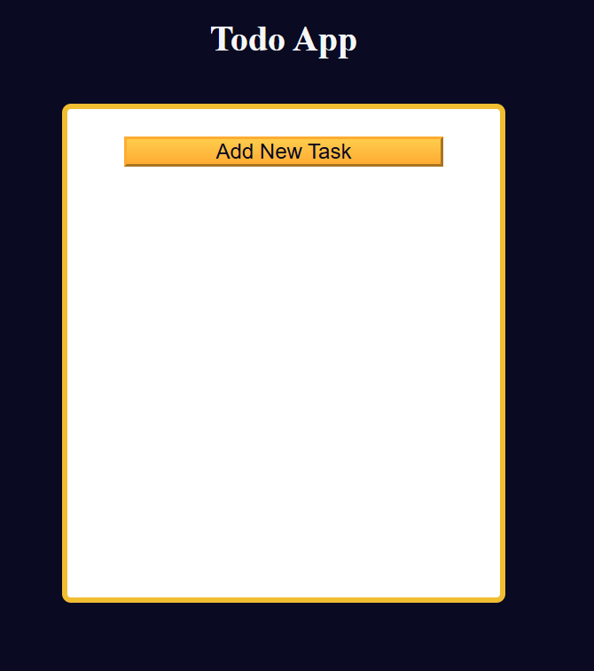
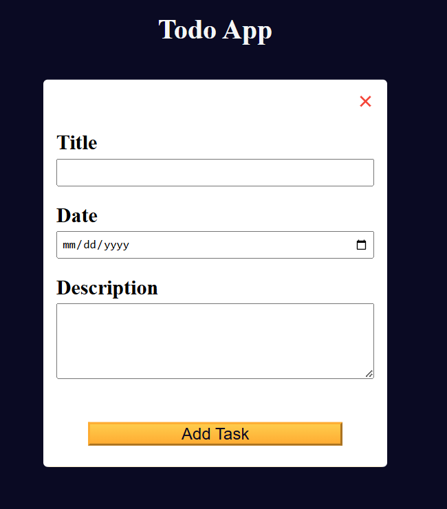

# TODO App

### **Project Description**

With this web application, you can manage and track your tasks. You can create new tasks with a custom title, date and additional description.
When a task is completed you can delete it.

### **Installation**
You need the latest browser to be able to View.
Follow this link:

   https://github.com/Iveto97/freeCodeCamp/tree/main/JavaScript%20Algorithms%20and%20Data%20Structures/todo-app

It is hosted by gitHub.

To access this project on your local files, you can download it using these steps:
1. Open your browser
2. Paste this link 
   
   https://downgit.github.io/#/home?url=https://github.com/Iveto97/freeCodeCamp/tree/main/JavaScript%20Algorithms%20and%20Data%20Structures/todo-app

3. This will save .zip file into your download folder
4. Extract files
5. Open the folder
6. Run `index.html` with an active internet

### **Usage**
   The application, displays user's tasks with title. date and description. Users can create tasks and delete them when they are completed.

The application supports the following options:

- Add new task: Create new task with title, date and description
- Update task: Change the details (title, date or description) of the created task
- Delete task: Delete completed task
  

### **Technologies**
1. HTML
2. CSS
3. JavaScript
4. Git

### **License**

MIT licensed

### **Screenshots**
The Application

